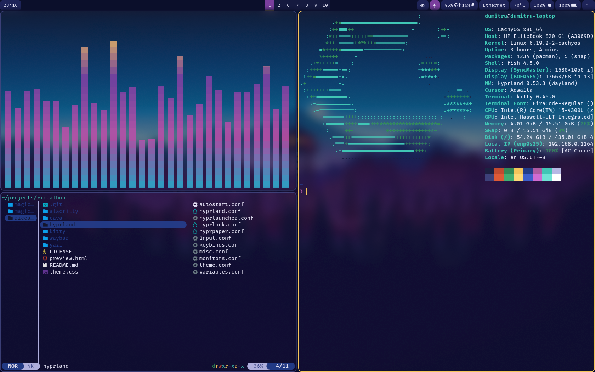

# Riceathon Dotfiles


My personal Hyprland desktop setup with all the configuration files you need to get a sleek, productive Linux desktop up and running.



## What's Included

- **Hyprland** - A beautiful tiling window manager for wayland
- **Hyprpaper** - Wallpaper daemon for setting backgrounds
- **Hyprlauncher** - Quick app launcher for Hyprland
- **Waybar** - A clean, customizable status bar at the top
- **Kitty** - A modern terminal emulator with lots of nice features
- **Alacritty** - An alternative terminal (configs still included) (Made the configs before switching to Kitty)
- **Yazi** - A snappy file manager for exploring your files
- **Cava** - Real-time audio visualizer for that extra flair ✨

## Directory Structure

```
riceathon/
├── hyprland/              # Hyprland window manager configs
│   ├── hyprland.conf      # Main configuration
│   ├── autostart.conf     # Autostart programs
│   ├── input.conf         # Input device settings
│   ├── keybinds.conf      # Keyboard shortcuts
│   ├── monitors.conf      # Monitor/display setup
│   ├── theme.conf         # Theme colors and styling
│   ├── misc.conf          # Miscellaneous settings
│   ├── variables.conf     # Environment variables
│   ├── hyprpaper.conf     # Wallpaper configuration
│   └── hyprlauncher.conf  # App launcher configuration
├── waybar/                # Status bar configuration
│   ├── config.jsonc       # Waybar layout and modules
│   └── style.css          # Waybar styling
├── kitty/                 # Kitty terminal config
│   └── kitty.conf
├── alacritty/             # Alacritty terminal config
│   └── alacritty.toml
├── yazi/                  # File manager configuration
│   ├── yazi.toml          # Main config
│   └── theme.toml         # Color theme
├── cava/                  # Audio visualizer config
│   └── config
└── README.md              # This file
```

## Getting Started

### What You'll Need

Before using these configs, make sure you have these installed:

- **Hyprland**
- **Hyprpaper**
- **Hyprlauncher**
- **Waybar**
- **Kitty** or **Alacritty**
- **Yazi**
- **Cava**
- **Fira Code Font**

### Quick Setup

1. **Clone this repo:**
   ```bash
   git clone https://github.com/N0TM3-1/dotfiles.git ~/riceathon
   ```

2. **Link the configs to the right places:**
   ```bash
   ln -s ~/riceathon/hyprland ~/.config/hypr
   ln -s ~/riceathon/waybar ~/.config/waybar
   ln -s ~/riceathon/kitty ~/.config/kitty
   ln -s ~/riceathon/alacritty ~/.config/alacritty
   ln -s ~/riceathon/yazi ~/.config/yazi
   ln -s ~/riceathon/cava ~/.config/cava
   ```

## Resources

- [Hyprland Documentation](https://wiki.hyprland.org)
- [Waybar Documentation](https://github.com/Alexays/Waybar)
- [Kitty Documentation](https://sw.kovidgoyal.net/kitty/)
- [Yazi Documentation](https://yazi-rs.github.io)

## License

This project is licensed under the GNU General Public License v3, See the [LICENSE](LICENSE) file for details.

## Helpful Tips

- **Reload quickly**: `Super` + `Shift` + `R` reloads Waybar
- **Something broken?**: Check the logs at `~/.local/share/hyprland/`
- **Changes not showing?**: Most things take effect instantly, but a full reload never hurts
- **Testing keybinds**: Use `hyprctl dispatch` to test window manager commands before committing